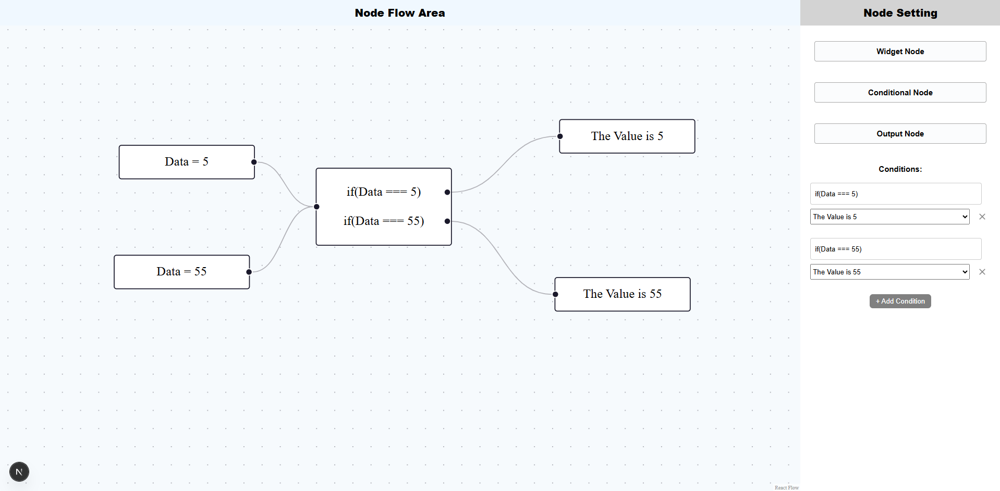

# 🧠 React Node Flow Builder
- A dynamic and interactive React Flow-based Node Editor for building conditional logic flows visually. Built using @xyflow/react (React Flow), this tool allows users to drag and drop various node types (Widget, Conditional, and Output) and configure connections and conditions through a user-friendly UI.

# ✨ Features

- 🎨 Drag & drop interface for node creation
- 🔌 Custom input, conditional, and output nodes
- 🔗 Dynamic edge generation and condition-based connections
- 🖱️ Node click to open contextual settings panel
- 🧩 Fully customizable node labels and conditions
- 🌈 Styled using styled-components


# 📦 Tech Stack

- React
- React Flow (@xyflow/react)
- TypeScript
- Styled-Components
- React Icons


# 🧑‍💻 How to Use

- Drag a node type (Widget, Conditional, Output) from the left sidebar into the canvas.
- Click a node to edit its properties in the right sidebar.
- For input nodes, you can assign a label and connect to a conditional node.
- For conditional nodes, add multiple conditions and define which output node they point to.
- For output nodes, just define the label.

# 📸 Screenshots


# 🔧 Future Enhancements

- Save/load flow from localStorage or backend
- Export/import flow data as JSON
- Validation and node completeness checks
- Better UX for connections and condition mapping


# 🙌 Acknowledgements

- React Flow by XYFlow
- Styled Components
- React Icons

This is a [Next.js](https://nextjs.org) project bootstrapped with [`create-next-app`](https://nextjs.org/docs/app/api-reference/cli/create-next-app).

## Getting Started

First, run the development server:

```bash
npm run dev
# or
yarn dev
# or
pnpm dev
# or
bun dev
```

Open [http://localhost:3000](http://localhost:3000) with your browser to see the result.

You can start editing the page by modifying `app/page.tsx`. The page auto-updates as you edit the file.

This project uses [`next/font`](https://nextjs.org/docs/app/building-your-application/optimizing/fonts) to automatically optimize and load [Geist](https://vercel.com/font), a new font family for Vercel.

## Learn More

To learn more about Next.js, take a look at the following resources:

- [Next.js Documentation](https://nextjs.org/docs) - learn about Next.js features and API.
- [Learn Next.js](https://nextjs.org/learn) - an interactive Next.js tutorial.

You can check out [the Next.js GitHub repository](https://github.com/vercel/next.js) - your feedback and contributions are welcome!

## Deploy on Vercel

The easiest way to deploy your Next.js app is to use the [Vercel Platform](https://vercel.com/new?utm_medium=default-template&filter=next.js&utm_source=create-next-app&utm_campaign=create-next-app-readme) from the creators of Next.js.

Check out our [Next.js deployment documentation](https://nextjs.org/docs/app/building-your-application/deploying) for more details.
